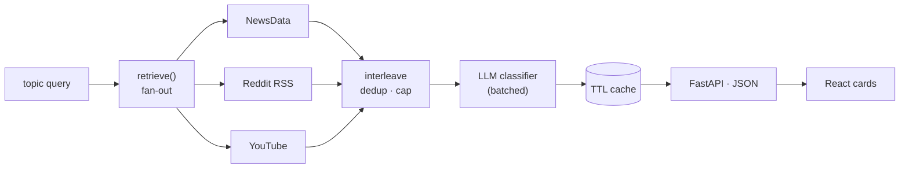

<p align="center">
  
</p>

<p align="center">
  Search any topic across <b>news, Reddit &amp; YouTube</b> — and see what's <i>reported</i>
  vs. what's <i>argued</i>,<br>with an AI fact-vs-opinion classifier that's <b>actually evaluated</b>.
</p>

<p align="center">
  <a href="https://nereus-app.netlify.app">
    
  </a>
</p>

<p align="center">
  
  
  
  
  
</p>

---

Enter a topic. Nereus pulls **live** content from three sources, classifies each item **fact vs.
opinion**, and renders it as faithful platform cards. Named for *Nereus*, the Greek sea-god who
could not tell a lie.

## ⭐ The differentiator: an *evaluated* classifier

Most "AI classifier" projects stop at *"I prompted an LLM."* Nereus **measures** it. I
hand-labelled **195 items from the app's own live feed** and scored the classifier against them:

|         | Precision | Recall |   F1  |
|---------|:---------:|:------:|:-----:|
| Factual |   0.89    |  0.85  | 0.87  |
| Opinion |   0.68    |  0.76  | 0.72  |

**Accuracy 0.82 · macro-F1 0.79 · 100% coverage** (`llama-3.1-8b-instant`). The full write-up —
including a confusion matrix, a confidence-threshold sweep, and an honest *"where it breaks"*
error analysis — is in **[MODEL_CARD.md](MODEL_CARD.md)**.

> The label isn't presented as gospel: the UI drops the raw confidence %, explains the method
> on hover, and shows the model's per-item reasoning. A signal, not a verdict.

## ✨ Features

- **Three live sources, one shape** — news ([NewsData.io](https://newsdata.io)), Reddit (public
  RSS, auto-upgrades to the OAuth API when creds are set), and YouTube (Data API v3), all
  normalized into a single `ContentItem`.
- **Faithful cards** — each source rendered true to its platform: click-to-play YouTube facades,
  Reddit points/comments, news thumbnails with outlet-logo fallbacks.
- **Editorial UI** — a warm serif/paper design, skeleton loading, scroll-reveal cards, and a
  fact/opinion badge with an on-hover rationale.
- **Built for free tiers** — batched + concurrently-run classification, TTL caching, and
  **graceful degradation** (items still render as "Unrated" instead of hanging when the LLM is
  rate-limited).
- **Hardened** — per-IP rate limiting, restricted CORS, http(s)-only URL sanitization, and a
  pytest suite.
- **Swap-ready architecture** — `SourceProvider`, `LLMClient`, `Classifier`, and a `retrieve()`
  seam mean you can add a source or swap the model in **one line**.

## 🛠 How it works



Every stage sits behind an interface, and concrete implementations are wired in exactly one
place (`app/main.py`). Phase 4 swaps the body of `retrieve()` for vector search — and nothing
else changes.

## 🧰 Tech stack

**Backend** — FastAPI · Python 3.12 · httpx · Groq (`llama-3.1-8b-instant`) · in-process TTL cache
**Frontend** — React 18 · Vite · lucide-react (thin client; zero business logic)
**Deploy** — Hugging Face Spaces (Docker) + Netlify · see [DEPLOY.md](DEPLOY.md)

## 🚀 Run it locally

```bash
# 1) backend
cd backend
python3 -m venv .venv && source .venv/bin/activate
pip install -r requirements.txt
cp .env.template .env          # add GROQ_API_KEY + NEWSDATA_API_KEY (both free, no card)
uvicorn app.main:app --reload  # → http://127.0.0.1:8000  (/docs for interactive API)

# 2) frontend (new terminal)
cd frontend
npm install && npm run dev     # → http://localhost:5173  (proxies /api to the backend)
```

```bash
# tests + re-run the classifier evaluation
cd backend && source .venv/bin/activate
pip install -r requirements-dev.txt && pytest
python eval/evaluate.py        # scores the classifier on the labelled set
```

Without keys the app still boots — each source returns empty and `/health` reports it down.
Keys: [Groq](https://console.groq.com/keys) · [NewsData](https://newsdata.io/register) ·
[YouTube](https://console.cloud.google.com) (optional; Reddit needs none).

## 📁 Layout

```
nereus/
├── MODEL_CARD.md          classifier evaluation + where it breaks
├── DEPLOY.md              HF Spaces + Netlify deploy guide
├── backend/               FastAPI + the AI core
│   └── app/
│       ├── main.py        API + middleware (the only place concretes are wired)
│       ├── models.py      ContentItem — the one normalized shape
│       ├── sources/       SourceProvider  → news / reddit / youtube
│       ├── llm/           LLMClient       → groq / gemini (swappable)
│       ├── classifier/    Classifier      → batched LLM classifier
│       ├── pipeline/      retrieve()      → fan-out · dedup · cap (the RAG seam)
│       ├── cache.py · ratelimit.py
│       └── eval/ · tests/
└── frontend/              React (Vite) — thin client over the API
```

<p align="center"><sub>Built as a portfolio project. Design, evaluation, and prose are my own.</sub></p>
